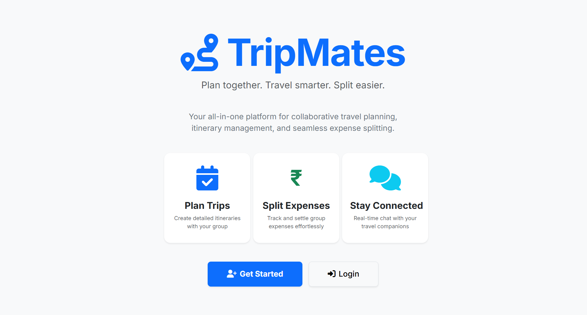
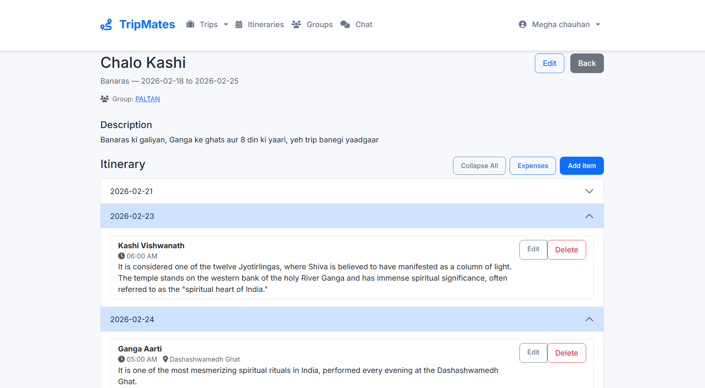
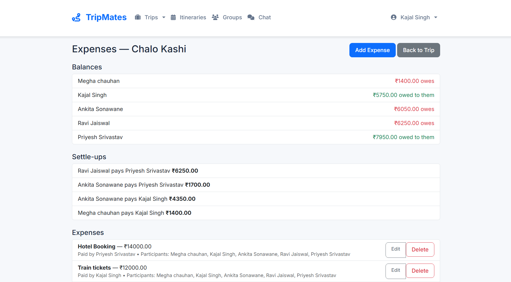
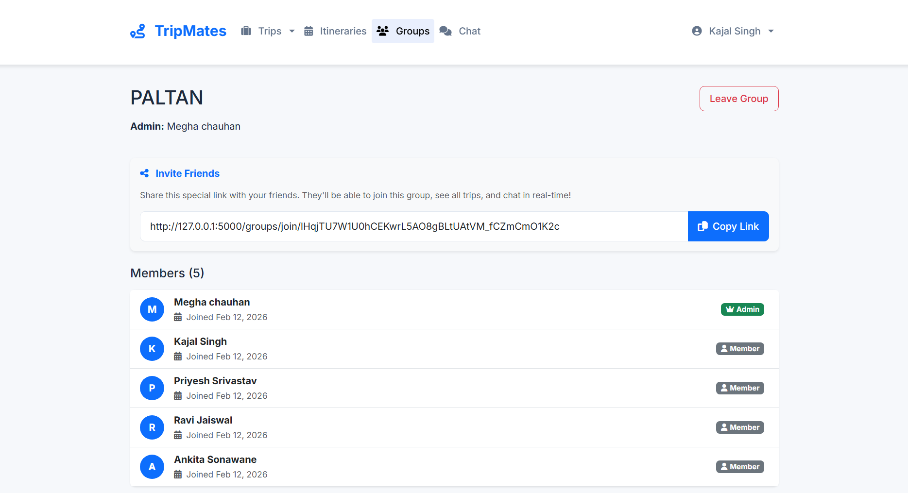
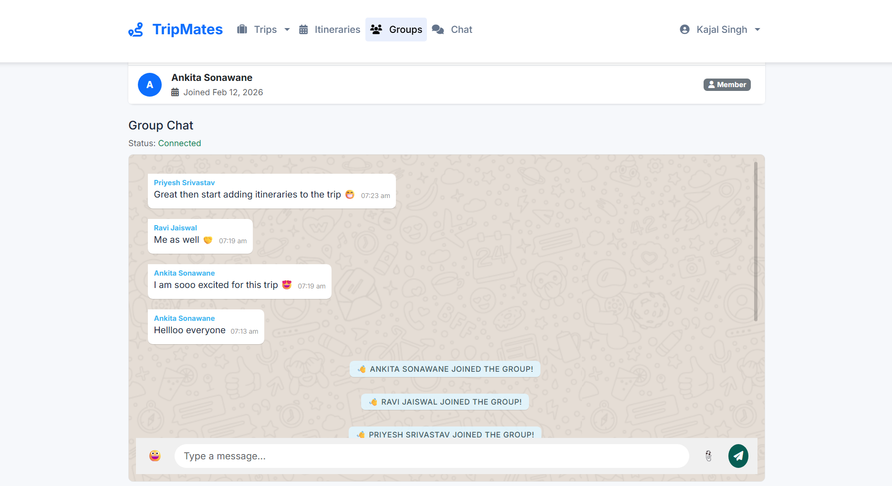

# 🌍 TripMates - Collaborative Travel Planning & Expense Management

> **Plan together. Travel smarter. Split easier.**

TripMates is a modern, full-featured web application designed to make group travel planning effortless. From creating detailed itineraries to managing shared expenses and staying connected through real-time chat, TripMates is your all-in-one companion for stress-free group adventures.




---

## ✨ Features

### 🗓️ **Trip Planning**
- Create and manage multiple trips with detailed information
- Build day-by-day itineraries with locations, times, and costs
- View all itinerary days simultaneously for a complete overview
- Optional time fields for flexible planning




### 💰 **Expense Management**
- Log group expenses with automatic splitting
- Track who paid and who owes
- Automated settlement calculations using optimized algorithms
- Detailed expense history per trip




### 👥 **Group Collaboration**
- Create private groups with secure invite links
- Admin controls for member management
- Join request approval system for enhanced privacy
- Regenerate invite links for security




### 💬 **Integrated Chat**
- Modern messaging interface with bubbles, emojis, and smooth scrolling
- Live message delivery with Socket.IO
- Emoji picker for expressive communication
- Chronological message ordering with accurate timestamps




### 🔐 **Security & Privacy**
- User authentication with secure password hashing
- Session management
- CSRF protection
- Role-based access control (Admin/Member)

---

## 🛠️ Tech Stack

| Layer | Technologies |
|-------|-------------|
| **Backend** | Python, Flask, Flask-SocketIO |
| **Database** | SQLite, SQLAlchemy ORM, Flask-Migrate |
| **Frontend** | HTML5, CSS3, JavaScript (ES6+) |
| **UI Framework** | Bootstrap 5, Font Awesome |
| **Real-Time** | Socket.IO, WebSockets |
| **Forms** | Flask-WTF, WTForms |
| **Authentication** | Flask-Login, Werkzeug Security |

---

## 🚀 Getting Started

### Prerequisites

- Python 3.8 or higher
- pip (Python package manager)
- Git

### Installation

1. **Clone the repository**
   ```bash
   git clone https://github.com/mgchauhan26/Collaborative-Expense-Itinerary-Management-System.git
   cd Collaborative-Expense-Itinerary-Management-System
   ```

2. **Create a virtual environment**
   ```bash
   python -m venv venv
   ```

3. **Activate the virtual environment**
   - Windows:
     ```bash
     venv\Scripts\activate
     ```
   - macOS/Linux:
     ```bash
     source venv/bin/activate
     ```

4. **Install dependencies**
   ```bash
   pip install -r requirements.txt
   ```

5. **Initialize the database**
   ```bash
   python scripts/create_tables.py
   ```

6. **Run the application**
   ```bash
   python app.py
   ```

7. **Access the application**
   - Open your browser and navigate to `http://127.0.0.1:5000`

---

## 📖 Usage Guide

### Creating Your First Trip

1. **Register/Login** - Create an account or log in
2. **Create a Group** - Set up a travel group and invite friends via shareable link
3. **Plan Your Trip** - Add trip details (destination, dates, description)
4. **Build Itinerary** - Add activities with times, locations, and estimated costs
5. **Track Expenses** - Log shared expenses as they occur
6. **Stay Connected** - Use the built-in chat to coordinate with your group

### Managing Expenses

- Click **"Add Expense"** on any trip
- Enter the description, amount, and who paid
- The system automatically calculates splits
- View settlements to see who owes whom

### Group Chat

- Access chat from the group detail page
- Send messages, emojis, and files
- Messages are delivered in real-time to all online members
- All communication is chronologically ordered

---

## 📁 Project Structure

```
TripMates/
├── app.py                  # Main application file
├── requirements.txt        # Python dependencies
├── .gitignore             # Git ignore rules
├── README.md              # This file
│
├── instance/              # Database and instance-specific files
│   └── tripmates.db       # SQLite database (gitignored)
│
├── migrations/            # Database migration files
│
├── scripts/               # Utility scripts
│   └── create_tables.py   # Database initialization
│
├── static/                # Static assets
│   ├── css/              # Stylesheets
│   ├── js/               # JavaScript files
│   └── uploads/          # User uploads (gitignored)
│
└── templates/             # HTML templates (Jinja2)
```

---

## 🎨 Key Highlights

- **Integrated Chat**: Modern messaging interface with bubbles, emojis, and smooth scrolling
- **Smart Settlements**: Optimized algorithm to minimize the number of transactions
- **Responsive Design**: Works seamlessly on desktop and mobile devices
- **Real-Time Updates**: Instant notifications for messages and group activities
- **Flexible Itineraries**: View all days at once or collapse for focused planning

---

## 🔮 Future Enhancements

- [ ] Expense analytics and visualization
- [ ] PDF export for trip summaries
- [ ] Push notifications for mobile
- [ ] Integration with mapping services
- [ ] Multi-currency support
- [ ] Expense receipt uploads

---

## 🤝 Contributing

Contributions are welcome! If you'd like to improve TripMates:

1. Fork the repository
2. Create a feature branch (`git checkout -b feature/AmazingFeature`)
3. Commit your changes (`git commit -m 'Add some AmazingFeature'`)
4. Push to the branch (`git push origin feature/AmazingFeature`)
5. Open a Pull Request

---

## 📄 License

This project is open source and available under the [MIT License](LICENSE).

---

## 👨‍💻 Author

**Megha Chauhan**
- GitHub: [@mgchauhan26](https://github.com/mgchauhan26)

---

## 🙏 Acknowledgments

- Built with [Flask](https://flask.palletsprojects.com/)
- UI powered by [Bootstrap](https://getbootstrap.com/)
- Real-time features by [Socket.IO](https://socket.io/)
- Icons from [Font Awesome](https://fontawesome.com/)

---

<div align="center">
  <p>Made with ❤️ for group travelers everywhere</p>
  <p>⭐ Star this repo if you find it helpful!</p>
</div>
